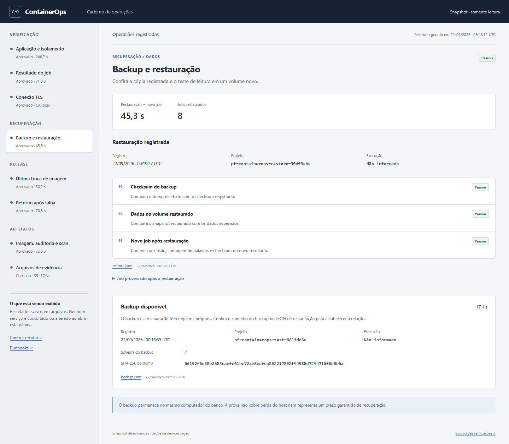

# ContainerOps

Verifique recuperação de processos, restauração de dados e troca de imagens em uma aplicação com API, worker e PostgreSQL. Cada operação registra o resultado e os arquivos que permitem conferir o que aconteceu.



Uma API recebe texto; o worker calcula palavras e SHA-256; o banco preserva trabalhos e resultados. Esse fluxo simples permite observar o efeito de uma falha, de uma restauração e do retorno à imagem anterior.

**Exemplo:** Alice envia `Olá, mundo!` com uma chave de idempotência. A primeira chamada cria um job; repetir a mesma chave e conteúdo devolve seu mesmo ID. O worker produz duas palavras e o checksum dos bytes originais. Se ele morrer após assumir o trabalho, outra tentativa pode recuperar esse ID; um token impede que o processo antigo sobrescreva o resultado. [Entrada, resultado e limites](docs/problem-solution.md#exemplo-repetição-da-chamada-e-morte-do-worker).

O PostgreSQL reúne fila, resultado e transações para manter o laboratório pequeno. Na recuperação, o projeto restaura o dump em outro volume, compara os dados e exige um novo job concluído. Na troca de versão, o rollback muda a imagem e conserva o schema compatível e os dados recentes. [Por que essas decisões e onde estão no código](docs/decisoes-tecnicas.md#problemas-que-orientaram-a-implementação).

## Conferir uma operação

Abra [docs/report.html](docs/report.html) localmente; o GitHub exibe o HTML como código. O relatório é um snapshot de evidências, sem comandos de operação ao vivo.

1. Em **Verificação**, confira a execução, suas etapas e o job registrado.
2. Em **Recuperação → Backup e restauração**, veja checksum, igualdade dos dados e novo job. Backup e restauração mantêm suas próprias datas e projetos.
3. Em **Release**, compare as imagens da troca e do retorno após falha controlada. Em **Artefatos**, confira a imagem à qual a auditoria e o scan se aplicam.

Os links abrem os JSONs de origem. Uma versão de job não identifica, por si só, a imagem de outra operação. [Como ler o relatório](docs/report-guide.md) · [cenários e resultados esperados](docs/problem-solution.md) · [roteiro da demonstração](docs/demo.md).

## Repetir a prova completa

```sh
python scripts/ops.py prove
```

Executa build, scan, restauração, TLS e troca de versão em projetos Docker descartáveis. Cada tentativa fica em `docs/evidence/problem-proof/`, com resultados e hashes. Exige Docker, OpenSSL e uma base Trivy preparada pelo comando `scan`. Essa prova é mais abrangente que `demo`, que envia um job à aplicação principal.

As [verificações publicadas](docs/verification.md) identificam a execução e as fontes testadas, incluindo a revisão posterior de isolamento de capacidade. Gerar outra versão do HTML não executa novamente essas provas.

## Rodar

Docker com containers Linux em máquina x86-64, Compose v2, Buildx e Python 3.11+. O primeiro build e scan baixam dependências.

```sh
python3 scripts/ops.py setup
python3 scripts/ops.py build
python3 scripts/ops.py verify
python3 scripts/ops.py start
python3 scripts/ops.py demo
python3 scripts/ops.py report
```

O [CI](.github/workflows/verify.yml) executa essa sequência e testa atualização, restauração e TLS. No Windows, use `python` ou o wrapper `scripts/containerops.ps1` com Docker Desktop em modo Linux. A API fica em [localhost:8105](http://localhost:8105); `/health/live` e `/health/ready` são públicos. Jobs exigem Bearer. O setup gera os tokens fictícios de `alice` e `bob` no runtime, fora do repositório; cada conta consulta apenas os próprios jobs.

## Operações

Execute `python scripts/ops.py <comando>`; o wrapper PowerShell chama o mesmo programa.

| Comando | O que faz |
|---|---|
| `build` / `start` | Gera OCI com SBOM e provenance e sobe com a imagem salva |
| `verify` | Lint, tipos, testes PostgreSQL/HTTP, hardening, redes, falha do banco e recriação |
| `prove` | Build/scan offline das duas versões, restore, TLS e release isolados, com manifesto |
| `backup` / `restore-test` | Dump com checksum e restauração em volume novo |
| `release` / `rollback` | Troca a imagem com smoke; volta pra anterior sem rebaixar o schema |
| `sbom` / `scan` | Inspeciona attestations e aplica a política do Trivy |
| `report` | Gera o HTML só com o que foi registrado |

Escrita usa um lock no runtime; `status`, `logs` e `report` continuam livres. Detalhes em [runbooks](docs/runbooks.md).

## Segurança das imagens

As bases são fixadas por digest. O scan bloqueia qualquer achado HIGH ou CRITICAL, inclusive sem correção disponível, e preserva todas as severidades no relatório. As [evidências da revisão](docs/verification.md) identificam imagens, cobertura e resultados; a [cadeia de suprimentos](docs/supply-chain.md) descreve a auditoria OCI, SBOM e provenance.

Instalações antigas com PostgreSQL Debian precisam de [migração por backup e restauração](docs/runbooks.md#troca-da-base-postgresql-debian-para-alpine). A imagem atual recusa volumes sem o marcador da plataforma compatível.

## Limites

Texto até 16 KiB, fila global de 100 trabalhos e limite de 20 queued/running por proprietário. A admissão aplica os dois limites atomicamente; excesso retorna 429 e mantém o replay idempotente. O despacho prioriza o proprietário menos recentemente ativo, preservando a ordem dos seus jobs elegíveis: um backlog de Alice não deixa Bob atrás de todos os trabalhos dela. [Correção e testes de isolamento de capacidade](docs/security.md).

O Compose habilita a demo com atraso máximo de 15 s por trabalho; `DEMO_MODE=false` aceita apenas duração zero. São 3 tentativas e retenção de 24 h. A distribuição não interrompe jobs já em execução nem garante prazo de atendimento. O projeto se destina à operação local. O backup fica na mesma máquina do banco. O TLS termina no proxy. O rollback troca a imagem, não rebaixa schema nem restaura dados antigos. O build copia os inputs pra um caminho ASCII temporário porque o BuildKit recusou o caminho com acento deste projeto. [Contrato de dados](docs/data-contract.md) · [arquitetura](docs/architecture.md) · [decisões técnicas](docs/decisoes-tecnicas.md).

Python, FastAPI, PostgreSQL, Nginx, Docker Compose e BuildKit. Licença MIT.
