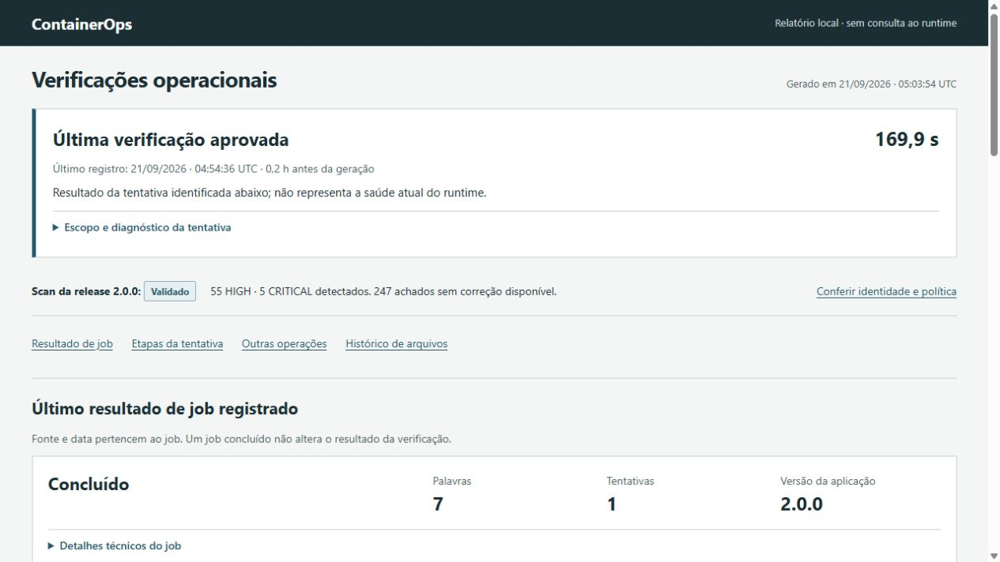

# ContainerOps

Montei um lab de Docker pra treinar operação. É uma API com worker e PostgreSQL que recebe texto e processa jobs, mas o objetivo real é testar as partes que dão medo em produção: recuperação, backup, restore, rollback e troca de imagem sem perder dados.



O relatório sai de [docs/report.html](docs/report.html) (abra local; o GitHub mostra o arquivo como código). O que cada operação faz e por que está em [problem-solution.md](docs/problem-solution.md).

## Um comando prova a cadeia inteira

```sh
python scripts/ops.py prove
```

Roda build, scan, restore, TLS e troca de release em projetos Docker descartáveis, sem tocar na stack principal, e guarda cada tentativa em `docs/evidence/problem-proof/`. Exige Docker, OpenSSL e uma base do Trivy local.

## Rodar

Docker com Compose v2, Buildx e Python 3.11+. O primeiro build e scan baixam dependências.

```sh
python3 scripts/ops.py setup
python3 scripts/ops.py build
python3 scripts/ops.py verify
python3 scripts/ops.py start
python3 scripts/ops.py demo
python3 scripts/ops.py report
```

São os mesmos comandos do CI ([verify.yml](.github/workflows/verify.yml)). No Windows uso `scripts/containerops.ps1` (Docker Desktop em modo Linux, PowerShell 7). A API sobe em http://localhost:8105; `/health/live` e `/health/ready` são públicos, os jobs exigem Bearer. Os tokens de `alice` e `bob` saem no setup, dentro do runtime (fora do repo), e cada um só lê os próprios jobs.

## Operações

Uso `scripts/ops.py <comando>`; o wrapper PowerShell chama o mesmo programa.

| Comando | O que faz |
|---|---|
| `build` / `start` | Gera OCI com SBOM e provenance e sobe com a imagem salva |
| `verify` | Lint, tipos, testes PostgreSQL/HTTP, hardening, redes, falha do banco e recriação |
| `prove` | Build/scan offline das duas versões, restore, TLS e release isolados, com manifesto |
| `backup` / `restore-test` | Dump com checksum e restauração em volume novo |
| `release` / `rollback` | Troca a imagem com smoke; volta pra anterior sem rebaixar o schema |
| `sbom` / `scan` | Inspeciona attestations e aplica a política do Trivy |
| `report` | Gera o HTML só com o que foi registrado |

Escrita usa um lock no runtime; `status`, `logs` e `report` continuam livres. Detalhes em [runbooks](docs/runbooks.md).

## O que o scan mostra

Em 21/09/2026, cada imagem (1.0.0 e 2.0.0) tem 247 vulnerabilidades sem correção disponível, 55 HIGH e 5 CRITICAL. A política só bloqueia HIGH/CRITICAL que tenham fix; deixei as sem correção no relatório em vez de esconder. [Cadeia de suprimentos](docs/supply-chain.md) e [verificação](docs/verification.md).

## Limites

Texto até 16 KiB, fila de 100, atraso da demo de 15 s, 3 tentativas, retenção de 24 h. O backup fica na mesma máquina do banco. O TLS termina no proxy. O rollback troca a imagem, não rebaixa schema nem restaura dados antigos. O build copia os inputs pra um caminho ASCII temporário porque o BuildKit recusou o caminho com acento deste projeto. [Contrato de dados](docs/data-contract.md) · [arquitetura](docs/architecture.md) · [decisões técnicas](docs/decisoes-tecnicas.md).

Python, FastAPI, PostgreSQL, Nginx, Docker Compose e BuildKit. Licença MIT.
