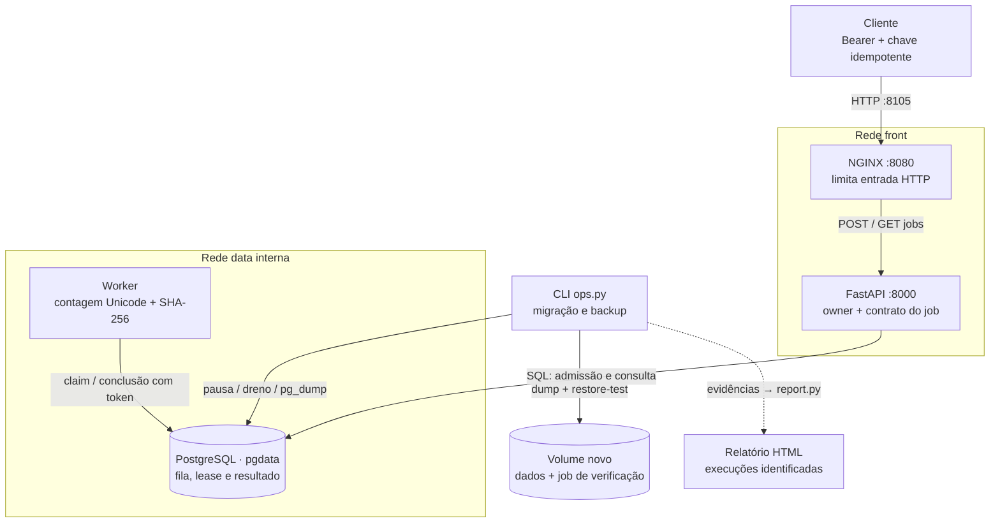

# ContainerOps

Laboratório de operação de uma aplicação com trabalhos em segundo plano: aceitar um pedido, recuperar um worker interrompido, trocar imagens e restaurar dados, mantendo o resultado verificável. Desenvolvi a API, o worker, os comandos de operação e o relatório de evidências.

<!-- Navegação do README -->
<p>
  <a href="#demonstração"></a>
  <a href="#arquitetura"></a>
  <a href="#executar-localmente"></a>
  <a href="#verificação-e-evidências"></a>
  <a href="https://www.linkedin.com/in/arthur-joanes-6a2967373/"></a>
</p>

## Visão geral

A API recebe texto; um worker conta palavras e calcula o SHA-256 dos bytes; PostgreSQL guarda fila e resultado. O cálculo pequeno permite conferir o que aconteceu depois da recuperação. Textos e falhas são **sintéticos**; HTTP, processos e banco executam localmente no mesmo computador.

Pelo [contrato](docs/data-contract.md), a mesma chave e conteúdo recuperam o job existente; conteúdo diferente conflita. O [repositório transacional](app/src/containerops/repository.py) controla uma posse temporária (_lease_) e seu token, impedindo que um [worker](app/src/containerops/worker.py) antigo sobrescreva a aquisição atual.

<a id="na-prática"></a>

## Demonstração


Captura real de **22/09/2026, 17:37 UTC**, gerada com registros históricos. A restauração exibida ocorreu às **06:20 UTC**: **3 jobs / 27,4 s**. Gerar o HTML não repetiu a operação. [Entradas e identificação](docs/screenshots/focused-20260922/inputs.json) · [outros focos](docs/screenshots.md) · [página completa versionada](docs/readme/home.png).

**Exemplo:** seis chamadas concorrentes enviaram `Olá mundo! Café e ação. 東京 42` com a mesma chave. Receberam um único ID e **sete palavras**; trocar o conteúdo retornou 409. A [jornada de **22/09/2026, 12:34 UTC**](docs/evidence/editorial-20260922/journey.json) registra as respostas segundo os [critérios do caso](docs/problem-solution.md). Esse resultado demonstra o cenário registrado, não execução única de qualquer efeito externo.

<a id="conferir-uma-operação"></a>

Abra o [relatório histórico da operação editorial](docs/evidence/editorial-20260922/operations-view/docs/report.html) localmente; GitHub apresenta HTML como código. Confira o job, depois backup/restauração e rollback. Cada painel liga sua operação ao JSON de origem, como mostra o [guia de leitura](docs/report-guide.md).

<a id="implementação"></a>

## Arquitetura



As setas contínuas representam chamadas e transferência de dados; as pontilhadas, geração de evidências. A API pertence às redes `front` e `data`; worker e banco apenas à `data`. API e worker usam a mesma imagem em processos separados. PostgreSQL guarda a fila e o resultado na mesma linha; o worker busca trabalho no banco, sem chamada direta da API. O [Compose](compose.yaml) mantém todos os serviços no mesmo host e publica HTTP em loopback; o banco não publica porta no host.

| Responsabilidade | Implementação e garantia |
| --- | --- |
| Aceitar e consultar | [API](app/src/containerops/api.py) + [repository](app/src/containerops/repository.py): `UNIQUE(owner, idempotency_key)`, comparação do conteúdo e limite de 100 pendentes globais/20 por owner na transação. Corpo até 32 KiB e texto até 16 KiB. Retorna 201 para criação, 200 para replay e 409 para conteúdo divergente. |
| Executar e recuperar | [Worker](app/src/containerops/worker.py): despacho favorece o owner menos recentemente ativo; calcula fora da transação e só grava com lease de 5 s/token válidos. Trabalho interrompido pode repetir, até três tentativas. |
| Persistir e operar | [Conexões](app/src/containerops/database.py) e [CLI](scripts/ops.py): papéis distintos para DML, migração e backup. Guarda dump/hash/snapshot no runtime local e restaura em volume novo. Release troca API/worker; rollback preserva o schema expansivo. |
| Observar e apresentar | [Logs estruturados](app/src/containerops/log.py), healthchecks e métricas internas; [relatório](scripts/report.py) lê arquivos de execuções identificadas e apresenta evidências estáticas. |

**Um job completo:** POST autenticado → admissão transacional → `queued` → claim com lease → cálculo → `succeeded` → GET pelo mesmo owner. Se o worker morrer, o próximo claim após expirar a lease conserva o ID e incrementa a tentativa. [Sequências, permissões e recuperação](docs/architecture.md) mostram o caminho normal e as operações de manutenção.

## Stack e decisões

<a id="stack"></a>

<p>
  
  
  
  
  
</p>

| Escolha                 | Motivo e compromisso                                                                                                     |
| ----------------------- | ------------------------------------------------------------------------------------------------------------------------ |
| FastAPI + worker Python | Separa admissão de cálculo; exige posse, renovação e tentativas.                                                         |
| PostgreSQL              | Reúne fila, estado e transações; API e fila disputam recursos.                                                           |
| NGINX + Compose         | Entrada HTTP/TLS e processos separados; não protege contra perda do host.                                                |
| BuildKit + Trivy        | Identifica artefatos e verifica vulnerabilidades conhecidas; scan não é certificação nem garantia de ausência de falhas. |

<a id="o-que-eu-implementei"></a>
<a id="decisões-que-podem-ser-conferidas"></a>

[Decisões, código e testes](docs/decisoes-tecnicas.md) · [bases fixadas por digest](docker/images.lock.json). Versões fixadas não significam versões mais recentes.

<a id="executar-e-verificar"></a>
<a id="rodar"></a>

## Executar localmente

Use Docker com containers Linux em **x86-64**, Compose v2, Buildx e Python **3.11+**. São os requisitos adotados pelos [comandos](scripts/ops.py), [imagens](docker/images.lock.json) e [CI](.github/workflows/verify.yml). Primeiro build e scan precisam baixar dependências.

```sh
python3 scripts/ops.py setup
python3 scripts/ops.py build
python3 scripts/ops.py verify
python3 scripts/ops.py start
python3 scripts/ops.py demo
python3 scripts/ops.py report
```

No Windows, use `python` ou o [wrapper PowerShell](scripts/containerops.ps1), com Docker Desktop em modo Linux. O [Compose](compose.yaml) publica a API em [localhost:8105](http://localhost:8105). Jobs exigem Bearer; o setup gera tokens fictícios fora do Git, conforme o [roteiro](docs/demo.md).

<a id="operações"></a>

[Runbooks](docs/runbooks.md) detalham `backup`, `restore-test`, `release`, `rollback`, `scan` e o runtime. `stop` preserva o volume; um comando de limpeza deve usar o projeto e o destino identificados pela operação.

<a id="repetir-a-prova-completa"></a>

## Verificação e evidências

| Pergunta                              | Fonte e data da execução                                                                                                                 | Limite                                                                                 |
| ------------------------------------- | ---------------------------------------------------------------------------------------------------------------------------------------- | -------------------------------------------------------------------------------------- |
| Worker interrompido recupera o job?   | [Antes/depois do SIGKILL](docs/evidence/editorial-20260922/recovery.json), **22/09/2026, 12:36 UTC**                                     | Mesmo ID concluiu na tentativa 2; cálculo pode repetir.                                |
| Os dados voltam após restore?         | [Restore JSON](docs/evidence/problem-proof/53365744ff7d4897a142f3bf897dbf39/restore.json), **22/09/2026, 12:38 UTC**                     | Três jobs comparados e novo trabalho concluído; volume novo no mesmo host.             |
| A admissão se distribui entre owners? | [Manifesto da medição](docs/evidence/admission-measurement/20260922T031250-0300-b87b5952/manifest.json), **22/09/2026, 06:12–06:15 UTC** | Três repetições: 120 aceitos/concluídos e 24 recusados; cenário local com dois owners. |

Para repetir a prova completa, prepare antes a base Trivy com `scan`; Docker e OpenSSL são necessários:

```sh
python scripts/ops.py prove
```

O [runner](scripts/proof.py) cria projetos descartáveis e registra manifestos por tentativa. Para executar somente job, rollback e restauração com as imagens já preparadas:

```sh
python scripts/ops.py prove --scenario operations
```

[Verificação e histórico de correções](docs/verification.md) · [fontes e afirmações](docs/fontes-e-afirmacoes.md). Não foram repetidos builds, scans ou falhas durante esta revisão da documentação.

<a id="limites-e-manutenção"></a>
<a id="segurança-das-imagens"></a>
<a id="limites"></a>

## Limites e segurança

- **16 KiB** por texto; **100** jobs pendentes globais; **20** por owner; **3** tentativas; retenção de **24 h**. São limites do [contrato](docs/data-contract.md), implementados no [domínio](app/src/containerops/domain.py) e no [repositório](app/src/containerops/repository.py); não medem capacidade.
- A demo permite atraso de até **15 s**; `DEMO_MODE=false` aceita duração zero. A distribuição não interrompe jobs em execução nem garante prazo. [Configuração](app/src/containerops/config.py) e [validação](app/src/containerops/api.py).
- Backup permanece no mesmo computador; TLS termina no proxy; rollback troca imagens sem rebaixar schema. [Runbooks](docs/runbooks.md).
- O scanner bloqueia HIGH/CRITICAL, inclusive sem correção. Um resultado sem achados vale para imagem/base/data registradas. [Política e escopo](docs/supply-chain.md).

## Documentação

| Para entender                    | Guia                                                                                                                            |
| -------------------------------- | ------------------------------------------------------------------------------------------------------------------------------- |
| Problema, componentes e escolhas | [Casos](docs/problem-solution.md) · [arquitetura](docs/architecture.md) · [decisões](docs/decisoes-tecnicas.md)                 |
| API, fila e idempotência         | [Contrato de dados](docs/data-contract.md)                                                                                      |
| Executar e recuperar             | [Demonstração](docs/demo.md) · [runbooks](docs/runbooks.md) · [recuperação](docs/operational-recovery.md)                       |
| Conferir resultados e fontes     | [Verificação](docs/verification.md) · [admissão](docs/admission-measurement.md) · [fontes e datas](docs/fontes-e-afirmacoes.md) |
| Interface e manutenção           | [Guia do relatório](docs/report-guide.md) · [capturas](docs/screenshots.md) · [padrão documental](docs/padrao-documentacao.md)  |

## Autor e licença

Para conversar sobre containers, recuperação e operação deste laboratório:

<p><a href="https://www.linkedin.com/in/arthur-joanes-6a2967373/"> <strong>Arthur Joanes no LinkedIn</strong></a></p>

[Licença MIT](LICENSE). Ícones da stack e LinkedIn: [Devicon — licença MIT](docs/stack/LICENSE.devicon).
