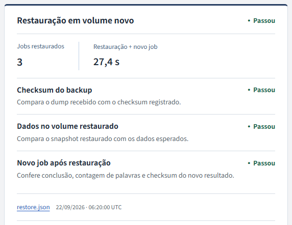
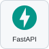

# ContainerOps

Desenvolvi este laboratório para conferir o que permanece correto quando um processo morre, uma imagem nova falha ou os dados precisam ser restaurados. Ele é útil para quem desenvolve ou opera uma aplicação pequena com trabalhos em segundo plano.

A API recebe texto; um worker conta palavras e calcula o SHA-256 dos bytes; PostgreSQL guarda fila e resultado. O cálculo simples deixa a pergunta principal verificável: **o trabalho aceito continua identificável e o resultado está correto depois da recuperação?** Os textos e as falhas são sintéticos; os processos, HTTP e banco são reais, no mesmo computador.

[Na prática](#na-prática) · [Implementação](#implementação) · [Executar e verificar](#executar-e-verificar) · [Limites e manutenção](#limites-e-manutenção)

<p></p>

## Na prática



Recorte de apresentação de **22/09/2026, 17:37 UTC**, gerada pelo renderer atual com os JSONs preservados. A restauração mostrada ocorreu às **06:20 UTC**: **3 jobs / 27,4 s**; gerar a página não repetiu a operação. [Recortes da restauração, cópia e novo job](docs/screenshots.md) · [fontes e dados usados](docs/screenshots/focused-20260922/inputs.json).

**Em outra execução histórica, às 12:38 UTC de 22/09/2026**, restaurei três jobs em outro volume e exigi um novo trabalho concluído. O relatório separa a cópia da restauração; o dump sozinho não comprovaria esse resultado. [Imagem em tamanho completo](docs/screenshots/editorial-20260922/restore.png) · [caso, comandos e limites](docs/demo.md#execução-editorial-de-22092026). A imagem é um snapshot dessa operação, sem controles ao vivo.

**Exemplo curto:** seis chamadas concorrentes enviaram `Olá mundo! Café e ação. 東京 42` com a mesma chave. Receberam um único ID e um resultado de **sete palavras**. Trocar o conteúdo mantendo a chave retornou 409. Em outro caso, matei o worker depois de assumir um job: o mesmo ID passou da tentativa 1 para a 2 e terminou com as cinco palavras esperadas. [Entrada, mecanismo e provas](docs/problem-solution.md).

### Conferir uma operação

Abra o [relatório da nova operação](docs/evidence/editorial-20260922/operations-view/docs/report.html) localmente; o GitHub exibe HTML como código. Ele contém somente job, cópia, restore e rollback dessa tentativa. O [relatório geral histórico](docs/report.html) permanece disponível com as próprias datas. Ambos são snapshots, sem comandos de operação ao vivo.

1. Em **Job**, confira o trabalho de quatro palavras registrado no início da operação.
2. Em **Backup e restauração**, confira os três jobs restaurados e as três verificações. Expanda **Resultado do novo job no volume restaurado** para consultar o trabalho posterior. Cópia e restauração mantêm suas próprias datas e projetos.
3. Em **Rollback**, compare as imagens da troca e do retorno após falha controlada. O relatório geral histórico inclui também **Verificação** e **Artefatos**; seus testes e scans pertencem às imagens e datas indicadas nele.

Os links abrem os JSONs de origem. Uma versão de job não identifica, por si só, a imagem de outra operação. [Como ler o relatório](docs/report-guide.md) · [cenários e resultados esperados](docs/problem-solution.md) · [roteiro da demonstração](docs/demo.md).

A [revisão da interface](docs/frontend-quality.md) registra as oito telas, os critérios de apresentação e as comparações com os mesmos dados. Ela verifica o relatório; não representa uma nova execução dos serviços.

<p></p>

## Implementação

### O que eu implementei

- Separei replay de conflito na admissão: mesma chave e conteúdo recuperam o job; conteúdo diferente não sobrescreve o pedido. A transação aplica também quotas global e por proprietário.
- Implementei posse temporária (_lease_) e token por aquisição. Um trabalho pode ser calculado novamente após a morte do worker, mas uma posse antiga não pode publicar por cima da atual.
- Organizei backup, cópia protegida, restore em volume novo, comparação de dados e processamento posterior. A proteção demonstrada continua limitada ao mesmo host.
- Separei troca de imagem de restauração de dados. A migração expansiva mantém a versão anterior compatível, preservando o job criado pela candidata antes de falhar.
- Construí os comandos de operação, verificações de falhas e o relatório offline com identidade por operação. Configurei FastAPI, PostgreSQL, Nginx, Docker/BuildKit e Trivy; essas ferramentas são de terceiros, integradas ao laboratório.

### Stack

<p>
  
  
  
  
  
</p>

Python e FastAPI na API e no worker; PostgreSQL na fila e nos resultados; NGINX na borda HTTP/TLS. Docker Compose e BuildKit sustentam execução e troca de imagens.

### Decisões que podem ser conferidas

| Situação executada                       | Resultado e compromisso                                                                            |
| ---------------------------------------- | -------------------------------------------------------------------------------------------------- |
| Seis requisições repetem a mesma chave   | Um UUID, sete palavras, checksum conferido; a chave pertence ao proprietário                       |
| Worker recebe SIGKILL após assumir o job | Mesmo UUID concluído na tentativa 2; o cálculo pode repetir, não há promessa de execução única     |
| Candidata 2 cria dados e falha no smoke  | API/worker voltam à imagem 1, schema fica em 2 e o job da candidata permanece                      |
| Cópia restaurada em volume novo          | Três jobs comparados e novo job com quatro palavras; não equivale a recuperação fora do computador |

Escolhi PostgreSQL para reunir fila, estado e transações deste laboratório. Isso evita operar outro serviço de mensagens, mas faz a fila disputar recursos com a API. O token complementa a lease: o prazo diz quando recuperar; o token diz qual aquisição ainda pode finalizar. [Decisões, alternativas, código e testes](docs/decisoes-tecnicas.md).

<p></p>

## Executar e verificar

### Rodar

Docker com containers Linux em máquina x86-64, Compose v2, Buildx e Python 3.11+. O primeiro build e scan baixam dependências.

```sh
python3 scripts/ops.py setup
python3 scripts/ops.py build
python3 scripts/ops.py verify
python3 scripts/ops.py start
python3 scripts/ops.py demo
python3 scripts/ops.py report
```

O [CI](.github/workflows/verify.yml) executa essa sequência e testa atualização, restauração e TLS. No Windows, use `python` ou o wrapper `scripts/containerops.ps1` com Docker Desktop em modo Linux.

A API fica em [localhost:8105](http://localhost:8105); `/health/live` e `/health/ready` são públicos. Jobs exigem Bearer. O setup gera os tokens fictícios de `alice` e `bob` no runtime, fora do repositório; cada conta consulta apenas os próprios jobs.

### Operações

Execute `python scripts/ops.py <comando>`; o wrapper PowerShell chama o mesmo programa.

| Comando                   | O que faz                                                                           |
| ------------------------- | ----------------------------------------------------------------------------------- |
| `build` / `start`         | Gera OCI com SBOM e provenance e sobe com a imagem salva                            |
| `verify`                  | Lint, tipos, testes PostgreSQL/HTTP, hardening, redes, falha do banco e recriação   |
| `prove`                   | Build/scan offline das duas versões, restore, TLS e release isolados, com manifesto |
| `backup` / `restore-test` | Dump com checksum e restauração em volume novo                                      |
| `release` / `rollback`    | Troca a imagem com smoke; volta pra anterior sem rebaixar o schema                  |
| `sbom` / `scan`           | Inspeciona attestations e aplica a política do Trivy                                |
| `report`                  | Gera o HTML só com o que foi registrado                                             |

Escrita usa um lock no runtime; `status`, `logs` e `report` continuam livres. Detalhes em [runbooks](docs/runbooks.md).

### Repetir a prova completa

```sh
python scripts/ops.py prove
```

Executa build, scan, restauração, TLS e troca de versão em projetos Docker descartáveis. Cada tentativa fica em `docs/evidence/problem-proof/`, com resultados e hashes. Exige Docker, OpenSSL e uma base Trivy preparada pelo comando `scan`. Essa prova é mais abrangente que `demo`, que envia um job à aplicação principal.

As [verificações publicadas](docs/verification.md) separam a prova histórica completa da nova rodada: builds locais, 58 testes de comandos, 47 do relatório, 116 da aplicação e falhas reais. A correção do registro que descobriu zero testes está explícita; suas contagens não são reaproveitadas. Gerar outra versão do HTML não executa novamente essas provas.

Para repetir apenas job, rollback e restauração após preparar as duas imagens:

```sh
python scripts/ops.py prove --scenario operations
```

Esse cenário tem [evidência própria](docs/operational-recovery.md) e não executa novamente scans, TLS ou a suíte completa.

<p></p>

## Limites e manutenção

### Segurança das imagens

As bases são fixadas por digest. O scan bloqueia qualquer achado HIGH ou CRITICAL, inclusive sem correção disponível, e preserva todas as severidades no relatório. As [evidências da revisão](docs/verification.md) identificam imagens, cobertura e resultados; a [cadeia de suprimentos](docs/supply-chain.md) descreve a auditoria OCI, SBOM e provenance.

Instalações antigas com PostgreSQL Debian precisam de [migração por backup e restauração](docs/runbooks.md#troca-da-base-postgresql-debian-para-alpine). A imagem atual recusa volumes sem o marcador da plataforma compatível.

### Limites

Texto até 16 KiB, fila global de 100 trabalhos e limite de 20 queued/running por proprietário. A admissão aplica os dois limites atomicamente; excesso retorna 429 e mantém o replay idempotente. O despacho prioriza o proprietário menos recentemente ativo, preservando a ordem dos seus jobs elegíveis: um backlog de Alice não deixa Bob atrás de todos os trabalhos dela. [Correção e testes de isolamento de capacidade](docs/security.md).

O Compose habilita a demo com atraso máximo de 15 s por trabalho; `DEMO_MODE=false` aceita apenas duração zero. São 3 tentativas e retenção de 24 h. A distribuição não interrompe jobs já em execução nem garante prazo de atendimento.

O projeto se destina à operação local. O backup fica na mesma máquina do banco. O TLS termina no proxy. O rollback troca a imagem, não rebaixa schema nem restaura dados antigos.

O build copia os inputs pra um caminho ASCII temporário porque o BuildKit recusou o caminho com acento deste projeto. [Contrato de dados](docs/data-contract.md) · [arquitetura](docs/architecture.md) · [decisões técnicas](docs/decisoes-tecnicas.md).

A [medição com dois proprietários](docs/admission-measurement.md) registrou três repetições: 120 pedidos aceitos e concluídos e 24 recusados por quota. Ela separa admissão, espera induzida pela parada do worker e retomada, com percentis por proprietário. Não esgota o limite global nem mede capacidade de produção.

Licença MIT.

Ícones da stack: [Devicon — licença MIT](docs/stack/LICENSE.devicon).
