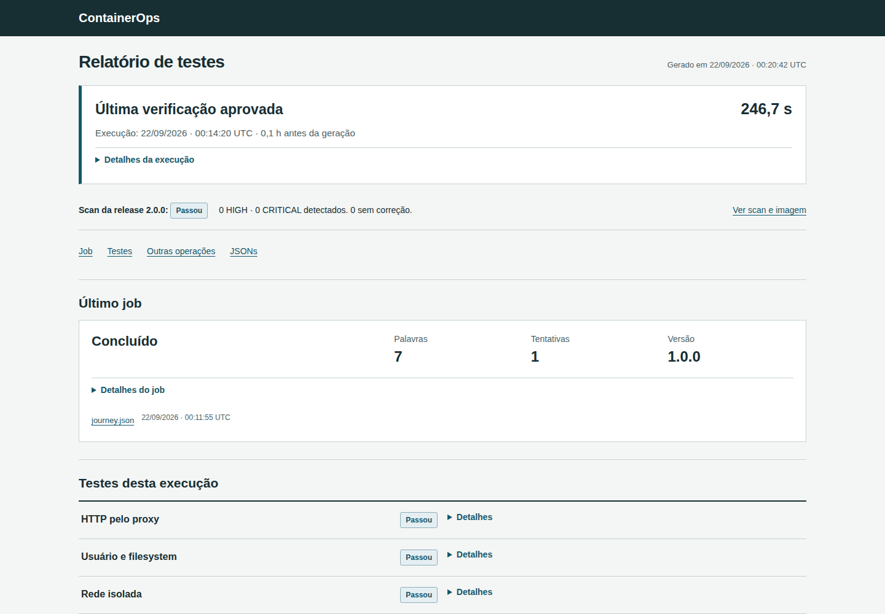

# ContainerOps

Laboratório de operação de serviços Docker. Uma API recebe texto, um worker calcula palavras e SHA-256, e o PostgreSQL mantém os trabalhos e resultados. O projeto exercita recuperação de processos, backup e restauração, atualização de imagens e rollback com dados persistidos.



O relatório sai de [docs/report.html](docs/report.html) (abra local; o GitHub mostra o arquivo como código). O que cada operação faz e por que está em [problem-solution.md](docs/problem-solution.md).

## Verificação completa

```sh
python scripts/ops.py prove
```

Executa build, scan, restauração, TLS e troca de versão em projetos Docker descartáveis. Cada tentativa fica em `docs/evidence/problem-proof/`, com resultados e hashes. Exige Docker, OpenSSL e uma base Trivy preparada pelo comando `scan`.

## Rodar

Docker com containers Linux em máquina x86-64, Compose v2, Buildx e Python 3.11+. O primeiro build e scan baixam dependências.

```sh
python3 scripts/ops.py setup
python3 scripts/ops.py build
python3 scripts/ops.py verify
python3 scripts/ops.py start
python3 scripts/ops.py demo
python3 scripts/ops.py report
```

O [CI](.github/workflows/verify.yml) executa essa sequência e testa atualização, restauração e TLS. No Windows, use `python` ou o wrapper `scripts/containerops.ps1` com Docker Desktop em modo Linux. A API fica em [localhost:8105](http://localhost:8105); `/health/live` e `/health/ready` são públicos. Jobs exigem Bearer. O setup gera os tokens fictícios de `alice` e `bob` no runtime, fora do repositório; cada conta consulta apenas os próprios jobs.

## Operações

Execute `python scripts/ops.py <comando>`; o wrapper PowerShell chama o mesmo programa.

| Comando | O que faz |
|---|---|
| `build` / `start` | Gera OCI com SBOM e provenance e sobe com a imagem salva |
| `verify` | Lint, tipos, testes PostgreSQL/HTTP, hardening, redes, falha do banco e recriação |
| `prove` | Build/scan offline das duas versões, restore, TLS e release isolados, com manifesto |
| `backup` / `restore-test` | Dump com checksum e restauração em volume novo |
| `release` / `rollback` | Troca a imagem com smoke; volta pra anterior sem rebaixar o schema |
| `sbom` / `scan` | Inspeciona attestations e aplica a política do Trivy |
| `report` | Gera o HTML só com o que foi registrado |

Escrita usa um lock no runtime; `status`, `logs` e `report` continuam livres. Detalhes em [runbooks](docs/runbooks.md).

## Segurança das imagens

As bases são fixadas por digest. O scan bloqueia qualquer achado HIGH ou CRITICAL, inclusive sem correção disponível, e preserva todas as severidades no relatório. As [evidências da revisão](docs/verification.md) identificam imagens, cobertura e resultados; a [cadeia de suprimentos](docs/supply-chain.md) descreve a auditoria OCI, SBOM e provenance.

Instalações antigas com PostgreSQL Debian precisam de [migração por backup e restauração](docs/runbooks.md#troca-da-base-postgresql-debian-para-alpine). A imagem atual recusa volumes sem o marcador da plataforma compatível.

## Limites

Texto até 16 KiB, fila global de 100 trabalhos, atraso da demo de 15 s, 3 tentativas, retenção de 24 h. A fila é compartilhada e não oferece quota ou equidade por usuário; o projeto se destina à operação local com usuários confiáveis. O backup fica na mesma máquina do banco. O TLS termina no proxy. O rollback troca a imagem, não rebaixa schema nem restaura dados antigos. O build copia os inputs pra um caminho ASCII temporário porque o BuildKit recusou o caminho com acento deste projeto. [Contrato de dados](docs/data-contract.md) · [arquitetura](docs/architecture.md) · [decisões técnicas](docs/decisoes-tecnicas.md).

Python, FastAPI, PostgreSQL, Nginx, Docker Compose e BuildKit. Licença MIT.
