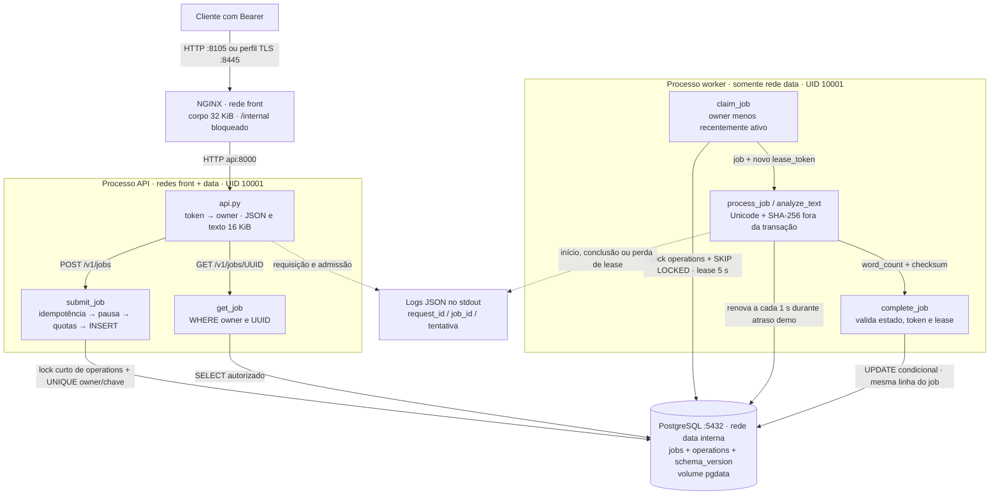
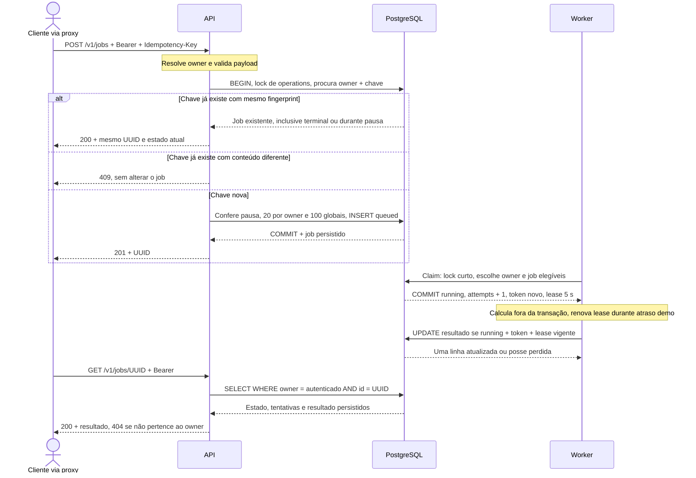

# Arquitetura do ContainerOps

O [Compose](../compose.yaml) organiza a [API](../app/src/containerops/api.py), o [worker](../app/src/containerops/worker.py) e o [repositório transacional](../app/src/containerops/repository.py). Os [comandos de operação](../scripts/ops.py) usam o [lock de imagens](../docker/images.lock.json). Quantidades e prazos abaixo são contratos e configurações, não capacidade de produção medida.

**Problema central:** depois de aceitar um trabalho, o serviço precisa permitir consultar seu resultado e recuperar falhas sem confundir a versão do programa com os dados persistidos. O cálculo de palavras é pequeno de propósito: torna possível conferir o resultado enquanto se examinam fila, morte do worker, restauração e retorno de versão. Todos os processos desta demonstração continuam no mesmo computador.

## Por que cada parte existe

| Parte                      | Responsabilidade neste problema                                                          | Custo e limite                                                                                                        |
| -------------------------- | ---------------------------------------------------------------------------------------- | --------------------------------------------------------------------------------------------------------------------- |
| API e proxy                | Receber o pedido autenticado, limitar a entrada e devolver um ID consultável             | Mais processos e configuração do que executar a função diretamente; proxy e API não substituem autorização no domínio |
| PostgreSQL                 | Guardar pedido, posse temporária, resultado e estado operacional na mesma transação      | Fila e consultas disputam o mesmo banco; o lock de admissão/despacho precisa de medição quando o histórico crescer    |
| Worker                     | Executar fora da requisição HTTP e permitir recuperar uma tentativa interrompida         | Requer lease, token e política de tentativas; o cálculo pode repetir                                                  |
| Compose e volumes          | Separar processos, redes e armazenamento; permitir destinos descartáveis de teste        | Não distribui a demonstração entre máquinas nem protege contra perda do host                                          |
| Migração, backup e restore | Trocar schema de forma explícita e verificar se dados restaurados permitem novo trabalho | A pausa de admissão afeta disponibilidade para novos pedidos; a cópia local compartilha a falha do computador         |
| Prova, scanner e relatório | Identificar fontes/imagens, testar operações e apresentar a evidência                    | São ferramentas de verificação, não serviços exigidos para contar palavras; o relatório não opera a aplicação         |

Para contar palavras em um único processo, uma função e um arquivo de saída seriam suficientes. A arquitetura maior atende aos cenários operacionais escolhidos para o laboratório; não é uma alegação de demanda comercial. [Exemplos e alternativas](problem-solution.md) · [decisões e dificuldades](decisoes-tecnicas.md).

## Limites entre aplicação e operação

Cenários e critérios: [problema e solução](problem-solution.md). `scripts/proof.py`
encadeia a sequência completa sem ampliar o domínio da aplicação: reutiliza as operações
de `ops.py`, o verificador e a auditoria OCI. Cada tentativa guarda manifesto, hashes,
fonte do código, imagens e snapshots em diretório próprio; uma falha ou interrupção
nunca registra sucesso. API e worker são conferidos separadamente. O rollback verifica
também o resultado do job criado pela candidata após a migração expansiva.

Backups de projetos descartáveis atualizam somente o ponteiro de seu próprio runtime.
`latest-backup.json` da stack principal continua apontando para seu backup. O dump
fica no diretório reservado de backups e `restore-test` usa projeto e volume novos.

No Windows, o runtime reservado é `%USERPROFILE%\AppData\Local\ContainerOps-runtime`. Os comandos Docker recebem o caminho resolvido por `Path.resolve()`, então junção ou link para essa pasta aponta para o mesmo runtime, não para um diretório adicional. Limpeza continua limitada aos projetos descartáveis e seus caminhos validados.

## Fluxo

O cliente envia texto pelo proxy e consulta a contagem de palavras e o SHA-256 do job. API e worker usam PostgreSQL para guardar a fila e os resultados. O [mapa de serviços no README](../README.md#arquitetura) mostra redes, volume e ferramentas; abaixo estão os módulos que executam cada etapa. Os grupos API/worker representam processos; seus blocos internos são funções/módulos, não serviços extras.

O único caminho publicado para jobs passa pelo proxy. O [Compose](../compose.yaml) conecta API a `front` e `data`; worker e banco somente a `data`, marcada `internal: true`, sem porta de banco no host. Segredos são arquivos montados nos serviços que os usam. A API resolve Bearer para owner a partir do arquivo de tokens carregado no startup; o repositório aplica esse owner nas consultas. [Conexões curtas](../app/src/containerops/database.py) usam papel de aplicação, timeout de conexão de 2 s, SQL de 3 s e espera de lock de 2 s.

### Do POST à consulta do resultado

O fingerprint inclui texto e duração solicitada; checksum do resultado usa somente os bytes UTF-8 originais. Replay consulta a linha existente antes de verificar pausa/quota, de modo que uma repetição válida não ocupa outra vaga. Para uma chave nova, pausa retorna 503 e fila cheia retorna 429 com `Retry-After`; validações anteriores podem recusar o pedido antes da transação. O [repositório](../app/src/containerops/repository.py) mantém admissão e despacho sob o mesmo lock curto de `operations`, mas libera o banco antes do cálculo. O teste de [concorrência e recuperação](../app/tests/test_integration.py) cobre essas fronteiras.

### Falha do worker e propriedade do resultado

| Evento | Transição persistida | Consequência |
| --- | --- | --- |
| Primeiro claim | `queued` → `running`, `attempts = 1`, token novo e `lease_until` | Só a tentativa que possui esse token pode renovar ou concluir enquanto a lease estiver vigente. |
| SIGKILL ou perda de lease | Após 5 s sem renovação, um claim elegível troca token e incrementa a tentativa no mesmo UUID | O cálculo pode repetir. Um worker antigo não sobrescreve o resultado, mesmo que termine depois. |
| Terceira tentativa expira | Próximo ciclo de claim marca `failed` e `error_category = attempts_exhausted` | GET explica a falha; replay não reenfileira automaticamente o job terminal. |
| Conclusão válida | `running` → `succeeded`; resultado e limpeza do token/lease no mesmo UPDATE | A consulta lê o resultado da mesma linha; não há janela entre confirmar fila e gravar resultado em outro sistema. |
| Banco indisponível | API retorna 503 para erro transitório; worker limita a seis falhas consecutivas com espera crescente | Ao esgotar o orçamento, worker sai com erro; Compose pode reiniciar o processo. O healthcheck por si só não reinicia um processo vivo. |

O despacho favorece o owner menos recentemente ativo entre os elegíveis, com desempate por criação e ID; não interrompe jobs que já estão em execução. `SKIP LOCKED` evita esperar pela linha de job ocupada, enquanto o singleton serializa a escolha entre workers. Isso é recuperação com execução possivelmente repetida, não uma garantia de executar o cálculo uma única vez.

## Serviços

| Serviço | Usuário                                                 | Redes        | Gravação                                   | Segredo                                  | Permissão                                |
| ------- | ------------------------------------------------------- | ------------ | ------------------------------------------ | ---------------------------------------- | ---------------------------------------- |
| proxy   | 101:101                                                 | front        | tmpfs /tmp limitado                        | chave TLS apenas em TLS                  | encaminhar HTTP; bloquear /internal      |
| api     | 10001:10001                                             | front, data  | tmpfs /tmp limitado                        | db_app, api_tokens                       | DML; usuário por Bearer; sem DDL         |
| worker  | 10001:10001                                             | data         | tmpfs /tmp limitado                        | db_app                                   | assumir/finalizar jobs; sem DDL          |
| db      | entrypoint inicializa volume; processo postgres UID 999 | data interna | volume nomeado pgdata, /var/run/postgresql | db_admin, db_migrator, db_app, db_backup | bootstrap de papéis; não exposto no host |
| migrate | 10001:10001                                             | data         | /tmp                                       | db_migrator                              | dono do schema, DDL explícito            |
| backup  | postgres                                                | data         | volume temporário para dump                | db_backup                                | CONNECT, USAGE, SELECT                   |
| restore | postgres                                                | data isolada | volume isolado                             | db_migrator do ambiente destino          | restauração como dono, sem superusuário  |

Compose configura redes, mounts, limites e ordem inicial. O kernel aplica as restrições. A API controla autorização e limites; o banco impede resultados duplicados. O cálculo pode repetir após expirar uma lease.

Admissão e despacho usam transações curtas no singleton de operações. A admissão
limita queued/running a 100 globais e 20 por owner. O despacho escolhe primeiro o
owner menos recentemente ativo entre os elegíveis; os workers executam fora do
lock e preservam lease/token. Esse controle resolve a ocupação da fila por um único
token, sem desligar o atraso da demo. Critério exato, concorrência e limites em
[contrato de dados](data-contract.md) e [segurança](security.md).

O worker atualiza um timestamp no tmpfs durante seu ciclo. A probe `containerops.worker_health` lê esse arquivo usando apenas a biblioteca padrão, sem carregar o driver PostgreSQL; aceita idade de até 20 segundos e recusa arquivo ausente, inválido ou no futuro. O timeout permanece em 3 segundos, com o mesmo limite de CPU do serviço.

## Contratos

### API e resposta

- **API:** `POST /v1/jobs` com Bearer e `Idempotency-Key` (1..128 ASCII), JSON {`text`, `demo_duration_seconds` opcional 0..15}; `GET /v1/jobs/{UUID}`; `/health/live`; `/health/ready`. Sem cookies/CORS público.
- **Resposta de job:** `id`, `state` (`queued`/`running`/`succeeded`/`failed`), `attempts`, `result` {`word_count`, `checksum`} ou `null`; `version` nas respostas de saúde e job. Release 2 acrescenta campo opcional `algorithm`, mantendo release 1 compatível.

### Limites e persistência

- Limite de texto UTF-8 16 KiB; corpo HTTP 32 KiB; fila global 100 e 20 pendentes por owner; retenção de terminais 24 h, limpeza explícita/worker; limite de tentativas 3; lease 5 s renovado durante duração demo limitada.
- **Tokenização:** sequências de caracteres Unicode alfanuméricos com marcas combinantes ligadas; apóstrofos e hífens separam. Checksum sobre bytes UTF-8 originais, sem normalização.
- **PostgreSQL `public`:** `schema_version(version integer)`; `operations` singleton para `admission_paused`; `jobs` (`UUID`, `owner`, `idempotency_key`, `payload`, `payload_hash`, `state`, `attempts`, `lease_token UUID`, `lease_until timestamptz`, `created_at`, `updated_at`, `completed_at`, `duration_seconds`, `word_count`, `checksum`, `error_category`). `UNIQUE(owner,idempotency_key)`; resultado armazenado na própria linha, conclusão condicionada ao token e lease vigente.

### Segredos e configuração

API tokens em `/run/secrets/api_tokens`: JSON objeto `owner -> token`. `db_password` em `/run/secrets/db_password`.

Variáveis `DB_HOST=db`, `DB_PORT=5432`, `DB_NAME=containerops`, `DB_USER=containerops_app`, `APP_VERSION=1.0.0`, `DEMO_MODE=true`. `APP_VERSION` é gravada no build; troca real usa imagens diferentes.

### Comandos e dependências

Comandos na imagem: `python -m containerops.api`; `python -m containerops.worker`; `python -m containerops.manage migrate --target 1|2`; `pause`; `resume`; `snapshot`; `cleanup`.

Manage usa `DB_USER`/segredo conforme serviço. Snapshot JSON determinístico com contagens e resultados ordenados, sem payload/segredos.

App dependências: FastAPI, Uvicorn, `psycopg[binary]`; testes pytest/httpx; lint Ruff e tipos mypy. Python 3.13, lock completo; host orquestra com stdlib Python 3.11+ e PowerShell fino que propaga exit code.

## Sequência operacional

Setup gera segredos somente demo fora do Git → build/test → db saudável → migração única → api/worker/proxy → readiness → jornada real. Stop preserva volume.

Backup pausa admissão e drena fila até zero `running`/`queued`, captura snapshot e dump custom enquanto permanece pausado, exporta binário por `docker cp`; finalmente retoma.

Restore valida hash e destino novo `pf-containerops-restore-*`, inicializa papéis, restaura sem ownership/ACL para migrator, reaplica grants, compara snapshot e processa job novo.

Release salva os IDs anteriores, faz backup, pausa e drena a fila, aplica migração expand-only e troca API/worker. Se readiness ou smoke falhar, volta aos IDs anteriores sem downgrade do banco.

## Imagens e runtime

Bases fixadas por digest em `docker/images.lock.json`; plataforma `linux/amd64`. Python e proxy usam Alpine. Multi-stage separa deps/test/runtime e a instalação Python aceita somente wheels. Config digest e camadas vinculam o OCI à imagem executada.

Trivy bloqueia qualquer HIGH/CRITICAL, inclusive sem correção disponível, e falha se a base estiver ausente ou incompleta.

PostgreSQL 17.11 também usa Alpine 3.24, com UID/GID 999 preservados na imagem própria. O entrypoint usa `su-exec` e exige um marcador de plataforma ao reutilizar PGDATA; volumes Debian antigos exigem backup/restore. O scan de serviços verifica banco e proxy além das duas releases da aplicação.

Runtime Windows: `%USERPROFILE%\AppData\Local\ContainerOps-runtime`. No Linux CI, o diretório é configurado para a execução. Runtime, secrets, caches, backups e OCI ficam fora das fontes. Os projetos Compose são pf-containerops, pf-containerops-test-* e pf-containerops-restore-*.

## Decisões

PostgreSQL concentra a fila e os resultados em quatro serviços. SQLite com um processo não exercitaria rede, roles e leases entre workers. Broker e Kubernetes acrescentariam serviços sem necessidade para este lab.

O backup local depende do mesmo host. Secrets do Compose são arquivos montados. TLS termina no proxy. Healthcheck unhealthy não reinicia um processo vivo. A idempotência expira com a retenção.

## Testes

Unitários de Unicode, checksum e validação; integração PostgreSQL para concorrência, leases e limites; testes pelo proxy para autorização, sinais, banco indisponível, recriação e redes; backup/restore, release/rollback, OCI, scan e sentinela.

Referências oficiais: [attestations Docker](https://docs.docker.com/build/metadata/attestations/), [exportadores OCI/Docker](https://docs.docker.com/build/exporters/oci-docker/) e [secrets no Compose](https://docs.docker.com/compose/how-tos/use-secrets/). As versões usadas são as do lock local; estas páginas não aprovam as imagens do laboratório.
