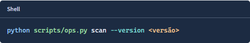

# Código no relatório

O [gerador](../scripts/report.py), o [template](../scripts/report.html) e o [CSS](../scripts/report.css) definem a apresentação do código. A captura e suas medidas estão no [recibo de 22/09/2026, 18:05 UTC](screenshots/syntax-20260922/review.json).

Os comandos de geração do relatório e de scan aparecem em blocos Shell compactos.
Comando, caminho, opção e valor a substituir recebem cores distintas. O texto
continua selecionável e preserva exatamente o comando original.



Captura de 22/09/2026, recortada diretamente do layout atual. O marcador `<versão>`
continua indicando o valor que deve ser substituído antes da execução no terminal.
Abrir o relatório não executa comandos.

O destaque faz parte do [HTML gerado](../scripts/report.html) e do
[renderer](../scripts/report.py), com [cores locais](../scripts/report.css).
Não exige JavaScript, conexão externa ou biblioteca adicional. Identificadores,
digests e valores de estado continuam como texto monoespaçado. Linhas extensas
rolam somente dentro do bloco, que aceita foco por teclado.

A [verificação](screenshots/syntax-20260922/review.json) cobriu as duas áreas em
1120, 390 e 320 px: texto dos comandos preservado, nenhum overflow de página,
nenhum erro JavaScript, nenhuma requisição externa e contraste mínimo de 4,5:1
nos tokens. O HTML atual foi gerado com os mesmos JSONs e o mesmo timestamp da
versão anterior; as provas sob `docs/evidence` não foram regravadas.

Reprodução dos testes:

```sh
python -m unittest discover -s scripts -p test_report.py -q
```
