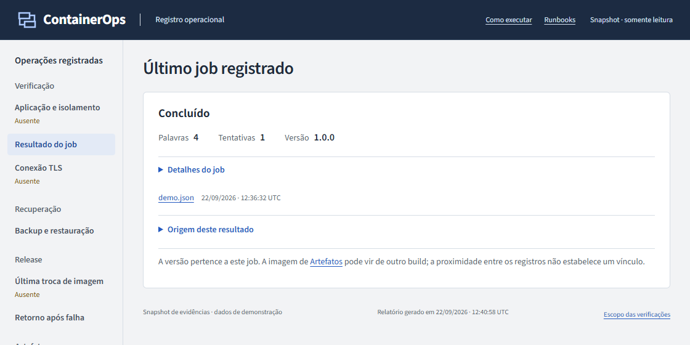

# Problema e solução

Fontes conferidas em **22/09/2026**: [contrato do domínio](../app/src/containerops/domain.py), [admissão e posse](../app/src/containerops/repository.py), [jornada de 22/09/2026](evidence/editorial-20260922/journey.json) e [recuperação da mesma rodada](evidence/editorial-20260922/recovery.json). As evidências antigas abaixo conservam suas próprias identidades.

## Tese e limite

Desenvolvi este laboratório para recuperar um serviço assíncrono pequeno sem perder trabalhos aceitos,
confundir uma imagem testada com outra executada ou tratar um dump como recuperação
testada. A jornada é: cliente envia texto e chave → API persiste → worker adquire
lease → resultado fica consultável → operador recupera falha, restaura e troca versão.
O papel representado é o operador de uma aplicação local; não há validação com
uma equipe externa, tráfego de produção ou compromisso de disponibilidade.

Um script que executa a função e salva um JSON resolve o cálculo, mas não as
fronteiras de admissão concorrente, morte do processo, credenciais, imagem e estado
persistido. PostgreSQL é suficiente como fila deste laboratório. Não há justificativa
para acrescentar broker ou orquestrador distribuído.

O [post-mortem do GitLab de 31/01/2017, publicado em 10/02/2017](https://about.gitlab.com/blog/postmortem-of-database-outage-of-january-31/) relata que os dumps esperados não estavam disponíveis: a ferramenta de backup usava uma versão incompatível com o banco. É um incidente observado por outra organização. Este laboratório reproduz a pergunta limitada “a cópia restaura e volta a processar?”, conferindo checksum, dados e um novo job; não reproduz aquele ambiente nem demonstra que evitaria o incidente. A cópia continua no mesmo computador.

A [documentação PostgreSQL sobre `SKIP LOCKED`](https://www.postgresql.org/docs/current/sql-select.html#SQL-FOR-UPDATE-SHARE) descreve o uso em tabelas de fila e a visão incompleta que ele produz quando ignora linhas bloqueadas. Aqui, o despacho usa esse mecanismo com uma transação curta, lease e token; o snapshot de restauração não usa `SKIP LOCKED`. São comportamentos documentados da plataforma, não evidência de escala ou uso em produção. Fontes consultadas em 22/09/2026.

## Exemplo: repetição da chamada e morte do worker

Considere Alice enviando `Olá, mundo!`, duração zero e chave `pedido-42`. A primeira admissão retorna 201 e um UUID; a mesma chave com o mesmo conteúdo retorna 200 e o mesmo UUID. Trocar o texto usando essa chave retorna 409. Bob pode ter sua própria `pedido-42`, mas consultar o UUID de Alice retorna 404. A chave é de cada proprietário, e o conteúdo inclui o atraso de demonstração: mudar a duração também muda o pedido.

[`submit_job`](../app/src/containerops/repository.py) resolve essa decisão na transação do banco, antes de consumir quota para um novo job. [`analyze_text`](../app/src/containerops/domain.py) conta duas palavras no exemplo e calcula SHA-256 dos bytes UTF-8 originais. A contagem tem uma regra explícita: `d'água guarda-chuva` conta quatro palavras. A regra não pretende fazer análise linguística. [Testes do contrato HTTP](../app/tests/test_http_contract.py), [domínio](../app/tests/test_domain.py) e [concorrência e isolamento entre proprietários](../app/tests/test_integration.py) permitem conferir cada fronteira.

Agora o worker morre com esse job em `running`. Após a lease expirar, [`claim_job`](../app/src/containerops/repository.py) pode assumir **o mesmo UUID**, aumentar a tentativa e emitir outro token. [`complete_job`](../app/src/containerops/repository.py) exige o token atual e lease válida: um worker antigo que volte não pode finalizar. O cálculo pode ocorrer mais de uma vez; o projeto não promete execução única. O [teste `test_stale_worker_cannot_renew_or_overwrite_result`](../app/tests/test_integration.py) verifica esse caso, enquanto a [prova histórica de recuperação](evidence/problem-proof/881fdd3dd92f4b7f86c6862e9022a589/verify-recovery.json) registra SIGKILL e retomada na tentativa 2 em containers reais.

## Conferência nova: identidade e posse do trabalho

Na rodada de 22/09 às 12:31 UTC, executei seis POSTs concorrentes com `Olá mundo! Café e ação. 東京 42`. A conta independente é Olá(1), mundo(2), Café(3), e(4), ação(5), 東京(6), 42(7). Houve **um UUID**, não seis trabalhos. O checksum usa os bytes originais; esta contagem não normaliza o texto nem pretende fazer análise linguística.

A relação entre seis chamadas e um UUID, o resultado de sete palavras, o conflito 409 e a recusa de leitura por outro proprietário são asserções da jornada HTTP, registradas em [journey.json](evidence/editorial-20260922/journey.json).

Em uma falha separada, o texto `Recuperar depois de término abrupto` tem cinco palavras. O worker morreu quando o job estava `running`, tentativa 1; a nova aquisição concluiu **o mesmo UUID** na tentativa 2. Eu não trato isso como execução única: o trabalho pode repetir. O [registro de recuperação](evidence/editorial-20260922/recovery.json) conserva antes/depois, SIGTERM, reinício e verificações do banco.

A proteção contra resultado antigo não é provada apenas pelo retorno após SIGKILL. O teste `test_stale_worker_cannot_renew_or_overwrite_result`, em [test_integration.py](../app/tests/test_integration.py), tenta renovar e concluir com uma posse obsoleta em PostgreSQL real; ambos são recusados. Ele integra os 116 casos aprovados da [rodada atual](evidence/editorial-20260922/execution.json). Essa regra protege a gravação local, não efeitos externos como cobrar ou enviar uma mensagem.

## Exemplo: o dump existe, mas o serviço voltou?

Na [execução histórica](verification.md#execução-de-22092026-utc), o backup continha oito jobs. [`backup`](../scripts/ops.py) pausou novas admissões e drenou a fila para comparar um snapshot estável com o dump. [`restore_test`](../scripts/ops.py) conferiu o checksum, restaurou em volume novo, comparou os oito jobs e enviou `Backup restaurado com sucesso`. O novo resultado teve **quatro palavras**, com checksum conferido. Essa última etapa evita aprovar uma restauração que deixou dados legíveis, mas uma aplicação incapaz de trabalhar.

O [JSON de restauração](evidence/problem-proof/881fdd3dd92f4b7f86c6862e9022a589/restore.json) registra 45,281 s observados, sem limpeza. Esse tempo não é um prazo garantido. O dump permanece no mesmo host; uma perda desse computador continua fora da proteção demonstrada.

## Exemplo: voltar a imagem sem apagar o trabalho recente

A release 2 amplia o schema e grava um job antes da falha controlada no smoke. [`release`](../scripts/ops.py) volta API e worker para a imagem anterior e confere que os resultados e o job criado pela candidata continuam presentes. A versão 1 funciona com o schema 2 porque a migração foi expansiva. [`rollback`](../scripts/ops.py) usa a mesma separação entre imagem e dados no retorno manual.

A [evidência de retorno](evidence/problem-proof/881fdd3dd92f4b7f86c6862e9022a589/rollback.json) e o [teste de compatibilidade das releases](../app/tests/test_integration.py), `test_release_two_schema_keeps_release_one_compatible`, documentam essa escolha. Restaurar um backup antigo como rollback apagaria o trabalho recente; por isso não faz parte desse comando. Migrações destrutivas exigiriam outra estratégia.

No relatório, percorra **Resultado do job → Backup e restauração → Última troca de imagem → Imagem, auditoria e scan**. Confira em cada detalhe data, projeto e imagem: esses registros podem pertencer a operações diferentes. O estado do job não certifica a release, e um scan de outra imagem não aprova a candidata. [Guia de leitura](report-guide.md).

## Execução histórica de 22/09/2026: imagem, dados e restauração

As três imagens abaixo preservam a execução original; a [galeria atual](screenshots.md) mostra o renderer atual sem repetir operações.

Na sequência de operações `53365744…`, processei um texto de quatro palavras, executei uma candidata 2 com falha controlada e voltei à imagem 1. O schema permaneceu na versão 2; os três jobs anteriores ao backup continuaram consultáveis. Em seguida, restaurei a cópia em outro projeto e comparei os dados antes de enviar `Backup restaurado com sucesso`: quatro palavras em um novo UUID.

_`Trabalho identificado e preservado` tem quatro palavras. Este é o job inicial da operação, distinto da jornada concorrente de sete palavras. [Registro](evidence/problem-proof/53365744ff7d4897a142f3bf897dbf39/demo.json) · [imagem completa](screenshots/editorial-20260922/initial-job.png)._

[Captura histórica completa: Retorno real após falha da candidata, com imagens anterior e candidata identificadas.](screenshots/editorial-20260922/rollback.png)

_Voltar à imagem 1 preservou o trabalho criado pela versão 2. A captura não representa downgrade do banco nem recuperação de um backup antigo. [Resultado completo](evidence/problem-proof/53365744ff7d4897a142f3bf897dbf39/rollback.json) · [imagem completa](screenshots/editorial-20260922/rollback.png)._

[Captura histórica completa: Três jobs restaurados, integridade e dados conferidos antes do novo trabalho.](screenshots/editorial-20260922/restore.png)

_São três critérios diferentes: checksum da cópia, comparação dos dados e novo job concluído. A cópia adulterada foi recusada antes de criar o destino. [Restore](evidence/problem-proof/53365744ff7d4897a142f3bf897dbf39/restore.json), [controle negativo](evidence/problem-proof/53365744ff7d4897a142f3bf897dbf39/corrupted-copy-rejected.json) e [preservação da origem](evidence/problem-proof/53365744ff7d4897a142f3bf897dbf39/source-preservation.json) sustentam o caso. Duração local não é SLA; cópia no mesmo computador não protege contra a perda dele._

A [demonstração executada](demo.md#execução-editorial-de-22092026) separa essa rodada das oito tarefas e 45,281 s históricos citados acima. Os nomes dos helpers e os contratos permaneceram iguais; nenhuma imagem antiga passou a receber a aprovação desta nova execução.

## Cenários

| Cenário                                        | Como é testado                                                                                                 | Critério                                                                                                                                              |
| ---------------------------------------------- | -------------------------------------------------------------------------------------------------------------- | ----------------------------------------------------------------------------------------------------------------------------------------------------- |
| Repetir admissão não duplica trabalho          | UNIQUE por owner/chave e lock em operations; seis POSTs concorrentes pelo proxy                                | Um UUID e um resultado com contagem e SHA-256; conflito 409 e outro owner 404                                                                         |
| Um owner não monopoliza a fila                 | Quota atômica de 20 pendentes por owner, 100 globais; despacho por atividade recente                           | Alice recebe 429 no limite enquanto Bob recebe 201; quatro despachos concorrentes com backlog de ambos distribuem dois para cada um; replay segue 200 |
| Worker morto deixa trabalho recuperável        | Lease temporal e token; SIGKILL/SIGTERM no projeto descartável                                                 | Job running antes, nova tentativa depois; SIGTERM conclui o atual sem adquirir o próximo; tentativa antiga não finaliza                               |
| A imagem demonstrada contém o código atual     | Build OCI, auditoria de manifest/config e SHA das fontes dentro das duas imagens; API e worker inspecionados   | As duas imagens têm os arquivos esperados e os dois serviços usam o ID solicitado                                                                     |
| Hardening e isolamento são efetivos            | Inspeção de kernel, mounts, escrita negada, conectividade e papéis DB em containers reais                      | UID/caps/rootfs/limites/redes/permissões observados; YAML sozinho não conta                                                                           |
| Backup recupera serviço utilizável             | Pausa/drenagem, dump binário, checksum; restore em projeto/volume novos                                        | Dump íntegro, snapshot igual e novo job com contagem/checksum corretos                                                                                |
| Rollback preserva dados pós-migração           | Migração expansiva; candidata cria job antes da falha; retorno à imagem 1                                      | Imagem 1 em API/worker, schema 2, resultados anteriores e job da candidata preservados, novo job concluído                                            |
| Operador repete o teste sem tocar a demo       | `prove` encadeia verificação, backup/restore, TLS e releases em projetos próprios, com manifesto por tentativa | Falha retorna código não zero; sucesso só após cleanup; tentativas anteriores preservadas                                                             |
| Artefato tem rastreabilidade e riscos visíveis | OCI/SBOM/provenance/sentinela/Trivy ligados ao mesmo config/manifest executado                                 | Digests conferidos; scan completo com base dentro da política, ou falha explícita                                                                     |

## Resultado esperado

O roteiro define os valores antes de executar: 3 jobs após a jornada (texto
concorrente, corpo no limite e replay de zero); 5 após candidata e retorno
automático; 6 após promoção; 7 após retorno manual; 8 após TLS. O restore deve
recuperar esses oito e processar um novo. Cada snapshot deve ter zero jobs
queued, running ou failed. Rejeições não podem adicionar linhas.

O [manifesto mais recente](evidence/problem-proof-latest.json) identifica a
tentativa, suas etapas e os hashes dos arquivos. A [verificação](verification.md)
registra os resultados da revisão para publicação. Tentativas anteriores ficam
preservadas em diretórios próprios; uma execução interrompida não herda o sucesso
de outra.

Os testes da aplicação, dos comandos de operação e do relatório são suítes
separadas. As falhas de processos, reinícios, restaurações e trocas de imagem
exercitam containers reais, além dos testes unitários. A aprovação vale para
este laboratório local e seus cenários documentados.
